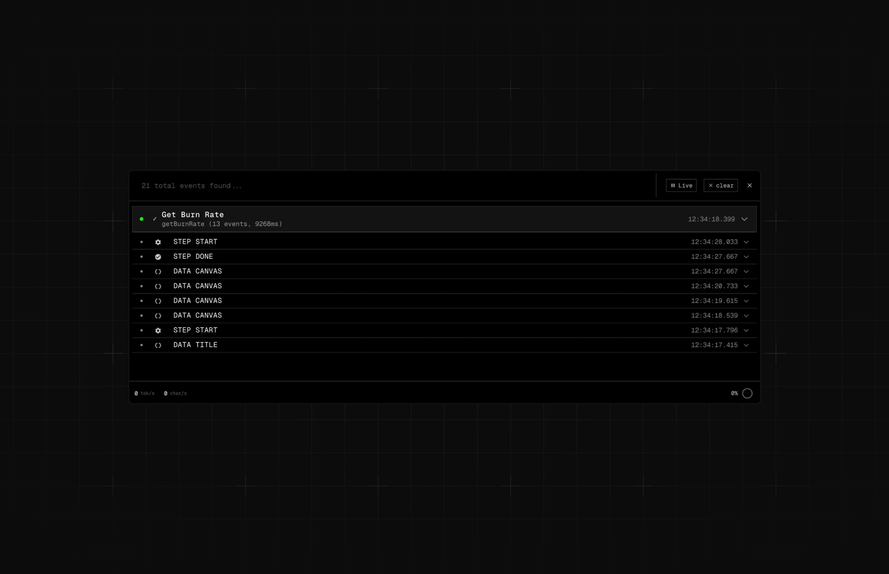

<br />

# AI SDK Devtools

A powerful debugging and monitoring tool for AI SDKs that provides real-time insights into AI streaming events, tool calls, and performance metrics.

## What it does

AI SDK Devtools helps you debug and monitor AI applications by:

- **Real-time event monitoring** - Track all AI streaming events as they happen
- **Tool call debugging** - See tool calls, parameters, results, and execution times
- **Performance metrics** - Monitor streaming speed (tokens/second, characters/second)
- **Event filtering** - Filter events by type, tool name, or search queries
- **Context insights** - Visualize token usage and context window utilization
- **Stream interception** - Automatically capture events from AI SDK streams
- **State management** - Optional integration with @ai-sdk-tools/store for state debugging

## Installation

```bash
npm install @ai-sdk-tools/devtools
```

### Optional Store Integration

For enhanced state debugging capabilities, you can optionally install the store package:

```bash
npm install @ai-sdk-tools/store
```

The devtools will automatically detect and integrate with the store if available, but it works perfectly fine without it for basic event monitoring.

**Note:** The store package is an optional peer dependency. If you don't install it, the devtools will work normally but without the State tab for debugging Zustand stores.

## Quick Start

### Basic Usage

```tsx
import { AIDevtools } from '@ai-sdk-tools/devtools';

function App() {
  return (
    <div>
      {/* Your AI app components */}
      
      {/* Add the devtools component - only in development */}
      {process.env.NODE_ENV === "development" && <AIDevtools />}
    </div>
  );
}
```

### With useChat Integration

```tsx
import { useChat } from 'ai/react';
import { AIDevtools } from '@ai-sdk-tools/devtools';
import { DefaultChatTransport } from 'ai';

function ChatComponent() {
  const { messages, input, handleInputChange, handleSubmit } = useChat({
    transport: new DefaultChatTransport({
      api: '/api/chat'
    }),
    ...
  });

  return (
    <div>
      {/* Your chat UI */}
      {process.env.NODE_ENV === "development" && <AIDevtools />}
    </div>
  );
}
```

## Features

### Event Monitoring
- **Tool calls** - Start, result, and error events
- **Message streaming** - Text chunks, completions, and deltas
- **Step tracking** - Multi-step AI processes
- **Error handling** - Capture and debug errors

### Advanced Filtering
- Filter by event type (tool calls, text events, errors, etc.)
- Filter by tool name
- Search through event data and metadata
- Quick filter presets

### Performance Metrics
- Real-time streaming speed (tokens/second)
- Character streaming rate
- Context window utilization
- Event timing and duration

### Visual Interface
- Resizable panel (drag to resize)
- Live event indicators
- Color-coded event types
- Context circle visualization

## Configuration

```tsx
<AIDevtools
  enabled={true}
  maxEvents={1000}
  modelId="gpt-4o" // For context insights
  config={{
    position: "bottom", // or "right", "overlay"
    height: 400,
    streamCapture: {
      enabled: true,
      endpoint: "/api/chat",
      autoConnect: true
    },
    throttle: {
      enabled: true,
      interval: 100, // ms
      includeTypes: ["text-delta"] // Only throttle high-frequency events
    }
  }}
  debug={false} // Enable debug logging
/>
```

## Advanced Usage

### Manual Event Integration

```tsx
import { useAIDevtools } from '@ai-sdk-tools/devtools';

function MyComponent() {
  const { 
    events, 
    clearEvents, 
    toggleCapturing 
  } = useAIDevtools({
    maxEvents: 500,
    onEvent: (event) => {
      console.log('New event:', event);
    }
  });

  return (
    <div>
      <button onClick={clearEvents}>Clear Events</button>
      <button onClick={toggleCapturing}>Toggle Capture</button>
      <div>Events: {events.length}</div>
    </div>
  );
}
```

### Event Filtering

```tsx
const { filterEvents, getUniqueToolNames, getEventStats } = useAIDevtools();

// Filter events
const toolCallEvents = filterEvents(['tool-call-start', 'tool-call-result']);
const errorEvents = filterEvents(['error']);
const searchResults = filterEvents(undefined, 'search query');

// Get statistics
const stats = getEventStats();
const toolNames = getUniqueToolNames();
```

## Event Types

The devtools capture these event types:

- `tool-call-start` - Tool call initiated
- `tool-call-result` - Tool call completed successfully
- `tool-call-error` - Tool call failed
- `message-start` - Message streaming started
- `message-chunk` - Message chunk received
- `message-complete` - Message completed
- `text-start` - Text streaming started
- `text-delta` - Text delta received
- `text-end` - Text streaming ended
- `finish` - Stream finished
- `error` - Error occurred

## Development

### Debug Mode

Enable debug logging to see detailed event information:

```tsx
<AIDevtools debug={true} />
```

Or enable globally:

```javascript
window.__AI_DEVTOOLS_DEBUG = true;
```

## Requirements

- React 16.8+
- AI SDK React package
- Modern browser with fetch API support

## Contributing

Contributions are welcome! See the [contributing guide](../../CONTRIBUTING.md) for details.

## License

MIT
